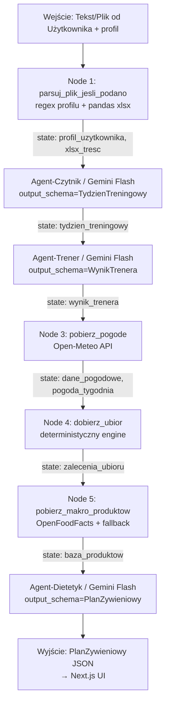

# 🏃‍♂️ Osobisty Agent Odżywiania Wytrzymałościowego (Endurance Nutrition Agent)

Projekt realizowany w ramach **Kaggle AI Agents: Intensive Vibe Coding Capstone**  
**Kategoria:** Agents for Good / Concierge Agents

---

## Cel MVP
Obsługa treningów biegowych i kolarskich (gravel) ze wsparciem dla realizacji celów wagowych (redukcja masy ciała, BPS – Bezpośrednie Przygotowanie Startowe).

---

## 1. Problem i Rozwiązanie (The Pitch)

- **Problem:** Sportowcy amatorzy mają dziś łatwy dostęp do zaawansowanych planów treningowych (np. w aplikacjach takich jak TrainingPeaks, Strava itp.), jednak kwestia odżywiania – która jest kluczowa dla regeneracji i wyników – jest często traktowana po macoszemu. Ręczne wyliczanie zapotrzebowania kalorycznego, adaptacja posiłków do rzeczywiście spalonych kilokalorii oraz reagowanie na zmienne warunki atmosferyczne (np. dodatkowe nawodnienie i sód podczas upałów) są czasochłonne, skomplikowane i podatne na błędy.
- **Rozwiązanie:** Wieloagentowy system AI, który przyjmuje nieustrukturyzowane dane o planowanym lub wykonanym treningu (np. skopiowane wiadomości z komunikatora, tabele z Excela), analizuje obciążenie treningowe i automatycznie generuje precyzyjny plan żywieniowy oraz zalecenia nawodnienia w oparciu o dane z zewnętrznych API.

---

## 2. Realizacja Wymogów Kaggle (Kryteria Oceny)

Projekt realizuje **4 z 5** głównych koncepcji z kursu ADK (Agent Development Kit):

1.  **System wieloagentowy (Multi-agent system):** ✅ ZAIMPLEMENTOWANY — Podział odpowiedzialności na wyspecjalizowane agenty orkiestrowane przez `Workflow`:
    - **Agent-Czytnik** (`agents/czytnik.py`): Gemini Flash, parsuje nieustrukturyzowany tekst do `TydzienTreningowy` (Pydantic). Obsługuje polską notację treningową (OWB1, GS, GR, Przeb., Podbiegi).
    - **Agent-Trener** (`agents/trener.py`): Gemini Flash, oblicza wydatek energetyczny każdej sesji i profil obciążenia tygodnia → `WynikTrenera`.
    - **Agent-Dietetyk** (`agents/dietetyk.py`): Gemini Flash, generuje kompletny tygodniowy plan żywieniowy z posiłkami, makroskładnikami i listą zakupów → `PlanZywieniowy`.

2.  **API Pogodowe (Open-Meteo):** ✅ ZAIMPLEMENTOWANY — Natywny node `pobierz_pogode()` (`nodes.py`) zamiast zewnętrznego MCP servera:
    - Geokodowanie nazwy miasta przez Open-Meteo Geocoding API.
    - 7-dniowa prognoza dzienna (temp. min/max, odczuwalna, wiatr, wilgotność, opady, kod pogody).
    - Flaga `wysokie_nawodnienie=True` gdy temp_avg > 25°C → korekta +500–750 ml płynów.

3.  **API Żywieniowe (OpenFoodFacts):** ✅ ZAIMPLEMENTOWANY — Natywny node `pobierz_makro_produktow()` (`nodes.py`) zamiast zewnętrznego MCP servera:
    - Integracja z OpenFoodFacts API (70+ produktów z anglojęzycznymi zapytaniami).
    - Lokalna baza fallback (`nutrition_data.py`) z wartościami USDA/IŻŻ dla ~60 produktów.
    - Produkty dobierane dynamicznie wg fazy periodyzacji (`bazowy`, `budowanie`, `BPS`, `redukcja`).

4.  **Agent Skills (Narzędzia Lokalne):** ✅ ZAIMPLEMENTOWANY:
    - Node `parsuj_plik_jesli_podano()` — parsowanie pliku `.xlsx` przez `pandas` (ścieżka w tekście: `Plik: /path/plan.xlsx`).
    - Ekstrakcja profilu regexem: `Waga: 75kg`, `Cel: bazowy`, `Płeć: M`.
    - Node deterministyczny `dobierz_ubior()` — rekomendacje stroju per sesja na podstawie temperatury odczuwalnej, intensywności i opadów.

---

## 3. Stos Technologiczny i Orkiestracja

### Backend — Python Agent

- **Framework Agentowy:** Natywny **ADK** (`google-adk>=2.0.0`), orkiestracja przez `Workflow` (liniowy pipeline).
- **Modele LLM:** Wszystkie trzy agenty używają `gemini-flash-latest` (szybki, tani, wystarczający dla ustrukturyzowanego wyjścia).
- **Walidacja Danych:** **Pydantic** — `output_schema` przy każdym agencie wymusza poprawny JSON (Structured Outputs ADK).
- **Zewnętrzne API:** Open-Meteo (pogoda), OpenFoodFacts (makroskładniki) — wywoływane przez `urllib` bez dodatkowych bibliotek HTTP.
- **Narzędzia:** `pandas` + `openpyxl` do parsowania plików xlsx.
- **Serwer:** `fast_api_app.py` — FastAPI wrapper nad ADK; uruchamiany przez `adk api_server`.

### Frontend — Next.js

- **Framework:** Next.js (`endurance-fuel/`) z TypeScript i Tailwind CSS.
- **Kluczowe komponenty:**
  - `ProfileForm.tsx` — formularz profilu (waga, płeć, cel, lokalizacja).
  - `TrainingInput.tsx` — pole wklejania planu treningowego (tekst lub ścieżka xlsx).
  - `WeeklyCalendar.tsx` — tygodniowy widok z podsumowaniem kcal per dzień.
  - `DayDetailPanel.tsx` — szczegóły dnia: posiłki, makro, nawodnienie, ubiór.
  - `DebugPanel.tsx` — podgląd stanów pośrednich wszystkich agentów (tydzien_treningowy, wynik_trenera, pogoda, baza_produktow).
- **API Route:** `app/api/generate-plan/route.ts` — proxy do ADK servera (SSE → JSON), timeout 3 min.
- **Zarządzanie profilem:** `hooks/useProfile.ts` — localStorage z domyślnym profilem.

---

## 4. Architektura Danych (Kontrakty Pydantic)

### `SesjaTreningowa` i `TydzienTreningowy` (Agent-Czytnik output)

```python
class SesjaTreningowa(BaseModel):
    dzien: Optional[int]             # 1=Pn, 7=Nd
    dyscyplina: str                  # Bieg | Rower | Silownia | Odpoczynek | Mieszany
    strefy_intensywnosci: Optional[list[str]]   # ['OWB1', 'GR', 'GS', 'Podbiegi']
    dystans_km: Optional[float]
    czas_trwania_min: Optional[int]
    interwaly_liczba: Optional[int]
    interwaly_dystans_m: Optional[float]
    tempo_docelowe: Optional[str]    # '5:00 - 5:10 min/km'
    RPE: Optional[int]               # 1–10
    odzywianie: Optional[str]        # 'Żele + WODA'
    dodatkowy_opis: Optional[str]

class TydzienTreningowy(BaseModel):
    sesje: list[SesjaTreningowa]
    laczny_dystans_km: Optional[float]
    lokalizacja: Optional[str]       # 'Kraków' — do geokodowania
    data_startowa: Optional[str]     # 'YYYY-MM-DD'
```

### `WynikTrenera` (Agent-Trener output)

```python
class WynikTrenera(BaseModel):
    profil: ProfilUzytkownika        # waga_kg, plec, cel
    sesje: list[SesjaZKcal]          # dzien, dyscyplina, kcal_szacowane, intensywnosc
    laczne_kcal_tydzien: int
    srednio_kcal_dzien_treningowy: int
    profil_obciazenia: str           # lekki | umiarkowany | ciezki | bardzo ciezki
    zalecenia_dla_dietetyka: str
```

### `PlanZywieniowy` (Agent-Dietetyk output)

```python
class PlanZywieniowy(BaseModel):
    streszczenie: str
    cel_kcal_dzien_treningowy: int
    cel_kcal_dzien_odpoczynku: int
    dni: list[DzienZywieniowy]       # posilki, nawodnienie_l, zalecenie_ubioru, uwagi
    zasady_kluczowe: list[str]
    lista_zakupow: list[str]
```

---

## 5. Przepływ Informacji (Workflow — zaimplementowany)



**Dane state przekazywane przez pipeline:**

| State key | Typ | Źródło | Konsument |
| --- | --- | --- | --- |
| `profil_uzytkownika` | JSON str | Node 1 | Agent-Trener |
| `xlsx_tresc` | str | Node 1 | Agent-Czytnik |
| `tydzien_treningowy` | JSON str | Agent-Czytnik | Agent-Trener, Node 3 |
| `wynik_trenera` | JSON str | Agent-Trener | Node 4, Node 5, Agent-Dietetyk |
| `dane_pogodowe` | JSON str | Node 3 | Agent-Dietetyk |
| `pogoda_tygodnia` | JSON str | Node 3 | Node 4, Agent-Dietetyk |
| `lokalizacja_treningu` | str | Node 3 | — |
| `zalecenia_ubioru` | JSON str | Node 4 | Agent-Dietetyk |
| `baza_produktow` | JSON str | Node 5 | Agent-Dietetyk |
| `plan_zywieniowy` | JSON str | Agent-Dietetyk | Next.js API Route |

---

## 6. Stan Implementacji

| Komponent | Status | Uwagi |
| --- | --- | --- |
| Agent-Czytnik | ✅ Gotowy | Gemini Flash, polska notacja, xlsx |
| Agent-Trener | ✅ Gotowy | Formuły kcal: bieg/rower/siłownia/odpoczynek |
| Agent-Dietetyk | ✅ Gotowy | Posiłki z makro, lista zakupów, periodyzacja |
| Pogoda (Open-Meteo) | ✅ Gotowy | 7-dniowa prognoza, geokodowanie, elektrolity |
| Dobór ubioru | ✅ Gotowy | Deterministyczny, wg temp./intensywności/deszczu |
| OpenFoodFacts | ✅ Gotowy | ~70 produktów + lokalna baza fallback |
| Parsowanie xlsx | ✅ Gotowy | pandas, ścieżka w tekście wejściowym |
| Next.js UI | ✅ Gotowy | Kalendarz, szczegóły dnia, debug panel |
| Eval pipeline | ✅ Gotowy | `tests/eval/`, dataset + grade results |
| Integration tests | ✅ Gotowy | `tests/integration/` |
| Dockerfile | ✅ Gotowy | Deployment-ready |
| Supabase / historia | ❌ Nie wdrożone | Wykraczało poza zakres MVP |

---

## 7. Znane Ograniczenia i Decyzje Projektowe

- **Gemini Flash zamiast Pro dla Dietetyka:** Wszystkie agenty używają `gemini-flash-latest` (tańszy, szybszy). Pro nie był potrzebny dla ustrukturyzowanych wyjść.
- **Native nodes zamiast MCP servers:** Pogoda i żywienie zaimplementowane jako deterministyczne node'y Python zamiast zewnętrznych MCP serverów — upraszcza deployment, eliminuje dodatkowe zależności.
- **Blokujący bug:** `google-genai>=2.9.0` powoduje hang przy imporcie przez moduł `_gaos`; wersja przypięta do `<2.9.0` w `pyproject.toml`.
- **Brak historii użytkownika:** Profile zapisywane tylko w localStorage przeglądarki; brak backendu bazy danych.
